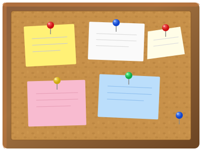

## Data Sharing Approaches

:::::: columns
::: {.column width="40%"}
**Too simple**

-   Email attachments
-   Messy file names and paths
-   Ad hoc versioning
-   `final_final_v3.csv`
:::

::: {.column width="20%"}
:::

::: {.column width="40%"}
**Too complicated**

-   Complex databases not always needed
-   Steep learning curve
-   Constant management
:::
::::::

## Enter {pins}

A package for **publishing and sharing** data, models, and other R objects

. . .

Key benefits:

-   **Versioned**: automatic version tracking
-   **Discoverable**: metadata and search
-   **Reproducible**: programmatic access
-   **Collaborative**: share across teams

## Installation

```{r}
#| eval: false
#| echo: true

# Install from CRAN
install.packages("pins")

# Load the package
library(pins)
library(dplyr)
```

# Basic Concepts

## What is a Pin?

A **pin** is a stored R object with metadata

. . .

You can pin:

-   Data frames

-   Trained models

-   Lists

-   Spatial objects (sf)

-   Any R object

-   Choose the file type ("csv", "json", "rds", "parquet", "arrow", "qs")

## What is a Board? {.center}

::::: columns
::: {.column width="\"50%"}
A **board** is where pins live

Think of it as a cork board that you can relocate:

-   Local folder
-   Network drive
-   Posit Connect
-   Cloud storage (S3, Azure, GCS)
-   URL (read-only)
:::

::: {.column width="\"50%"}
{fig-align="right" width="500"}
:::
:::::

## Four Main Functions

```{r}
#| eval: false
#| echo: true

# Create a pins board 
my_board <- board_folder("my_temporary_board")

# Write a pin
my_board %>% pin_write(my_data, "my-dataset")

# Read a pin
the_data <- my_board %>% pin_read("my-dataset")

# List available pins
my_board %>% pin_list()
```

# Live Demo {background-color="#40666e"}

## Create a Local Board

```{r}
#| eval: false
#| echo: true

library(pins)

# Create a board in a local folder
my_board <- board_temp(versioned = TRUE)

my_board <- board_folder("penguins_board", versioned = TRUE)
# Creates folder if none exists. 

# board_folder() creates a board inside a folder
# board_local() creates a board in a system data directory
# board_temp() is useful for examples and tests.
```

## Pin Some Data

```{r}
#| eval: false
#| echo: true

# Sample data
my_penguins <- penguins %>%
  filter(species == "Adelie")

# Pin it with metadata
my_board %>% pin_write(
  my_penguins,
  name = "adelie-penguins",
  title = "Adelie Penguins",
  # type = "csv", # Defaults to .rds
  description = "Palmer Penguins: Adelies only"
)
```

## Read the Pin

```{r}
#| eval: false
#| echo: true

# List available pins
my_board %>% pin_list()
my_board %>% pin_search()
my_board %>% pin_meta("adelie-penguins")

# Read the pin
retrieved_data <- my_board %>% pin_read("adelie-penguins")

# View it
head(retrieved_data)
```

## Update and Version

```{r}
#| eval: false
#| echo: true

# Update the data
my_updated_penguins <- my_penguins %>%
  mutate(observer = "Joe Corra")

# Write again (creates new version)
my_board %>% pin_write(my_updated_penguins, "adelie-penguins")

```

## Access Specific Versions

```{r}
#| eval: false
#| echo: true

# Check versions
my_board %>% pin_versions("adelie-penguins")

# Read a specific version
old_penguins <- my_board %>% pin_read(
  "adelie-penguins",
  version = "20260304T153852Z-0156c"  # old timestamp
)

# Prune old versions (keep last 5)
my_board %>% pin_versions_prune("adelie-penguins", n = 5)

```

## Metadata and Discovery

```{r}
#| eval: false
#| echo: true

# View metadata
board %>% pin_meta("ippu-dist-ammonia")

# Search for pins
board %>% pin_search("ammonia")

# Delete a pin
board %>% pin_delete("ippu-dist-ammonia")
```

# Real-World Use Cases

## Use Case 1: Reference Data

Share lookup tables and reference datasets:

-   Data dictionaries
-   Measurement units and conversion factors
-   Geographic mappings
-   Standard assumptions

. . .

**Benefit**: Everyone uses the same version, easily updated centrally

## Use Case 2: Analysis-Ready Data

One person cleans messy data, others analyze:

```{r}
#| eval: false
#| echo: true

# Data engineer cleans and pins
clean_data <- raw_data %>% 
  clean_names() %>%
  filter(!is.na(key_field))

board %>% pin_write(clean_data, "analysis-ready-data")

# Analysts read and use
analysis_data <- board %>% pin_read("analysis-ready-data")
```

## Use Case 3: Model Deployment

Store models for production use:

```{r}
#| eval: false
#| echo: true

# Fit and pin a model
model <- lm(flipper_len ~ body_mass + sex, data = penguins)
board %>% pin_write(model, "penguin-phys-model")

# Load in production script
model <- board %>% pin_read("penguin-phys-model")
new_predictions <- predict(model, new_data)
```

## Use Case 4: Caching Expensive Operations

Cache API calls or database queries:

```{r}
#| eval: false
#| echo: true

# Check if cached version exists
if (!"api-data" %in% board %>% pin_list()) {
  # Expensive API call
  api_data <- fetch_from_api()
  board %>% pin_write(api_data, "api-data")
} else {
  # Use cached version
  api_data <- board %>% pin_read("api-data")
}
```

# When NOT to Use Pins

## Limitations to Consider

Pins may not be the best choice for:

. . .

-   **Very large datasets** (multi-GB) - consider databases or direct Arrow files
-   **High-frequency updates** - real-time data needs a database
-   **Formal data warehousing** - enterprise data infrastructure
-   **Extremely sensitive data** - may need database with audit logs

## When Pins Shines

The "sweet spot":

-   **Medium-sized datasets** (MBs to low GBs)
-   **Sharing among small teams**
-   **Objects that don't fit in databases** (models, lists, sf objects)
-   **Quick collaboration** without infrastructure overhead

. . .

**Think of it as**: Too complex for email, too simple for a full database

# Beyond Local Boards

## Board Types

Different boards for different needs:

```{r}
#| eval: false
#| echo: true

# Network drive
board <- board_folder("//server/shared/team-pins")

# Posit Connect
board <- board_connect()

# AWS S3
board <- board_s3("my-bucket")

# Azure
board <- board_azure("container", "account")

# Google Cloud
board <- board_gcs("bucket")
```

## board_url() for Read-Only Sharing

Publish pins via simple web hosting:

```{r}
#| eval: false
#| echo: true

# Connect to a board hosted at a URL
board <- board_url(c(
  "population_density" = "https://example.com/data/population_density.rds",
  "pop_by_county" = "https://example.com/data/pop_by_county.rds"
))

# Read a pin
pop_data <- board %>% pin_read("pop_by_county")
```

. . .

Great for: GitHub Pages, internal web servers, publishing reference data

## Recommendations for Your Team

**Start simple**: `board_folder()` on a shared network drive

. . .

**If you have Posit Connect**: Use it! Purpose-built for this.

. . .

**Cloud-enabled**: S3/Azure/GCS boards scale well

. . .

**The best board depends on what your IT already supports**

# Common Questions

## "Why not just use GitHub?"

GitHub works great for small CSVs in code repos!

. . .

Pins adds value for:

-   Non-CSV objects (models, lists, sf data)
-   Separating data updates from code commits
-   No git overhead for data consumers
-   Automatic metadata and versioning
-   Easy programmatic access

## "Why not SharePoint?"

SharePoint absolutely works!

. . .

But consider:

-   **Fragile file paths** that break when folders reorganize
-   **Manual version management** (file naming or web interface)
-   **No R-native integration** (just reading from paths)
-   **Discovery** requires browsing folders

. . .

**Pins solution**: `pin_read("clean-data")` works the same for everyone

## "Can I download any CSV from a website?"

Not really the purpose of `board_url()`

. . .

For raw CSVs on websites, just use:

```{r}
#| eval: false
#| echo: true

data <- read.csv("https://example.com/data/file.csv")
```

. . .

`board_url()` is for datasets **specifically published as pins**

# Working with Arrow/Parquet

## Parquet, Feather, Arrow - Brief Intro

**Parquet**: Columnar file format, compressed, great for storage

**Feather**: Faster, less compressed, good for temporary use

**Arrow**: The ecosystem/engine that works with both formats

. . .

All work across R, Python, SQL, Spark, etc.

## Pins + Arrow

```{r}
#| eval: false
#| echo: true

library(arrow)

# Write as arrow
board %>% pin_write(my_data, "dataset", type = "arrow")

# Read (still loads into memory)
data <- board %>% pin_read("dataset")
```

. . .

**For larger data**, use `pin_download()`:

```{r}
#| eval: false
#| echo: true

# Download without loading
path <- board %>% pin_download("dataset")

# Use Arrow for lazy evaluation
arrow::open_dataset(path) %>%
  filter(year == 2024) %>%
  collect()
```

# Wrap Up

## Key Takeaways

1.  Pins solves version control and discovery for data sharing
2.  Simple API: `pin_write()`, `pin_read()`, `pin_list()`
3.  Multiple board types fit different infrastructure
4.  Best for medium-sized data and R-to-R collaboration
5.  Complements (not replaces) Git, SharePoint, databases

## Resources

-   Package documentation: [pins.rstudio.com](https://pins.rstudio.com)
-   GitHub: [github.com/rstudio/pins-r](https://github.com/rstudio/pins-r)
-   RStudio Community: [community.rstudio.com](https://community.rstudio.com)

## Questions?

Thank you!

------------------------------------------------------------------------

**Contact**: corra.joseph\@epa.gov

